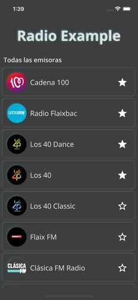
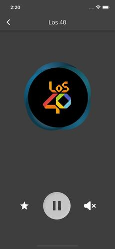

# Radio Example

Ejemplo sencillo de una radio a bajo nivel y no para uso comercial.

## Tiempo dedicado

- Planificación (1h): Elección de librerias, recopilación de la información sobre las radios (streams y fotos) y por último el diseño inicial de la aplicación.
- Animaciones (1h): Creación de las dos animaciones(Animación de la carga de las radios y la animación durante la reproducción)
- Desarrollo (5h): Desarrollo de todos los componentes de la aplicación.

## Capturas

- Lista de radios

- Radio

